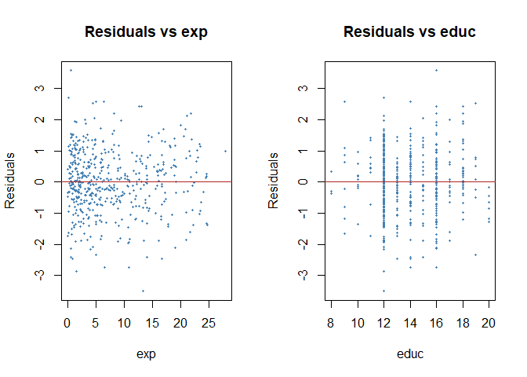
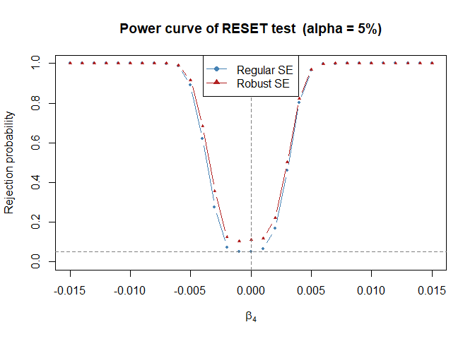
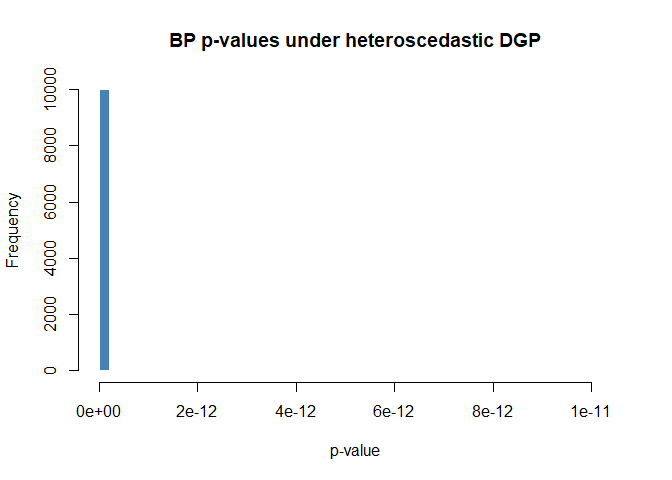

Assignment 2
================
14/03/2026

## Part 1

You might develop part 1 and part 2 separately, but in the end it should
be combined and kitted into one pdf. Be aware that this will only
succeed if ALL chunks are error-free.

------------------------------------------------------------------------

The chunk below can be used for reading the data file and setting up the
variables needed for estimating the model. You might even include some
basic statistics and (scatter)plots.

RMarkdown sections can be used, either to comment on the {r} chunk
above,

------------------------------------------------------------------------

or to introduce the next {r} chunk.

``` r
### 1.1 Model Estimation & Interpretation ###
# Construct matrix X #
X <- cbind(1, data$educ, data$exp)
X <- as.matrix(X)

# Calculate estimated coefficients #
beta_hat <- solve(t(X) %*% X) %*% t(X) %*% y

# Calculate fitted value of y #
y_hat <- X %*% beta_hat

# Calculate residuals #
e_hat <- y - y_hat

### 1.2 Correlation ###
# Calculate SSR #
ssr <- sum(e_hat^2)

# Calculate the variance-covariance matrix #
k <- ncol(X)
sigma2_hat <- ssr / (n - k)
var_beta <- sigma2_hat * solve(t(X) %*% X)

# Extract the entries we need #
var_b2 <- var_beta[2, 2]
var_b3 <- var_beta[3, 3]
cov_b23 <- var_beta[2, 3]

# Calculate the correlation #
corr_b23 <- cov_b23 / (sqrt(var_b2) * sqrt(var_b3))

### 1.3 Non-linearity Test ###
### a ###
# Construct the auxiliary matrix #
y_hat2 <- y_hat^2
X_reset_a <- cbind(X, y_hat2)
X_reset_a <- as.matrix(X_reset_a)

# Calculate auxiliary coefficients #
beta_reset_a <- solve(t(X_reset_a) %*% X_reset_a) %*% t(X_reset_a) %*% y

# Derive the estimated new coefficient #
gamma2_hat <- beta_reset_a[4]

# Perform the F-test #
res_a <- compute_f_test(y, X, X_reset_a)

### b ###
# Construct the auxiliary matrix #
y_hat3 <- y_hat^3
y_hat4 <- y_hat^4
X_reset_b <- cbind(X_reset_a, y_hat3, y_hat4)
X_reset_b <- as.matrix(X_reset_b)

# Calculate auxiliary coefficients #
beta_reset_b <- solve(t(X_reset_b) %*% X_reset_b) %*% t(X_reset_b) %*% y

# Derive the estimated new coefficient #
gamma3_hat <- beta_reset_a[5]
gamma4_hat <- beta_reset_a[6]

# Perform the F-test #
res_b <- compute_f_test(y, X, X_reset_b)

### 1.4 Test for heteroscedasticity ###
# Compute squared residuals #
e2 <- e_hat^2

# Perform auxiliary regression on Z variables #
Z <- X 
beta_bp <- solve(t(Z) %*% Z) %*% t(Z) %*% e2

# Calculate R-squared of auxiliary regression #
e2_hat <- Z %*% beta_bp
ssr_aux <- sum((e2 - e2_hat)^2)
tss_aux <- sum((e2 - mean(e2))^2)
r2_aux <- 1 - (ssr_aux / tss_aux)

# Compute LM statistic # 
lm_stat <- n * r2_aux

# Calculate P-value (Chi-squared distribution with p-1 degrees of freedom) #
df_bp <- ncol(Z) - 1
p_val_bp <- 1 - pchisq(lm_stat, df_bp)
```

## Part 2

In the chunk below, a matrix is constructed containing a column with
ones and two regressors taken from the given data files.

## Exercise 2.1

### One sample of $n = 500$

``` r
set.seed(100)
eps  = rnorm(n, 0, sigm0)           # generate disturbances N(0, sigma^2)
ysim = Xdgp %*% beta0 + eps         # together with X, your data set is complete

#
#  Code for exercise 2.1
#

# Set up the misspecified model (only constant, educ, exp)
X = cbind(rep(1, n), educ, exp)
k = ncol(X)

XtX      = t(X) %*% X               # matrix with basic statistics (n, sum(x), sum(x^2))
XXinv    = solve(XtX)                # matrix used in Variance of estimator b
diagXXinv = diag(XXinv)             # the diagonal elements (for the variance of b)
XXinvX   = XXinv %*% t(X)           # part of the estimator betahat that remains the same

# Estimate coefficients #
beta_sim = XXinvX %*% ysim

# Compute fitted values and residuals #
yhat_sim = X %*% beta_sim
e_sim    = ysim - yhat_sim

# Plot residuals to inspect non-linearity #
par(mfrow = c(1, 2))
plot(exp,  e_sim, pch = 19, cex = 0.4, col = "steelblue",
     xlab = "exp",  ylab = "Residuals", main = "Residuals vs exp")
abline(h = 0, col = "firebrick")
plot(educ, e_sim, pch = 19, cex = 0.4, col = "steelblue",
     xlab = "educ", ylab = "Residuals", main = "Residuals vs educ")
abline(h = 0, col = "firebrick")
```

<!-- -->

``` r
par(mfrow = c(1, 1))
```

``` r
#
#  More code for exercise 2.1 (RESET test)
#

# Construct augmented matrix with yhat^2, yhat^3, yhat^4 (p = 3) #
yhat_sim2  = yhat_sim^2
yhat_sim3  = yhat_sim^3
yhat_sim4  = yhat_sim^4
X_reset    = cbind(X, yhat_sim2, yhat_sim3, yhat_sim4)
X_reset    = as.matrix(X_reset)

# Perform the F-test (regular SE) #
res_reset  = compute_f_test(ysim, X, X_reset)

# Compute heteroscedasticity-robust Wald test for the three gamma's #
beta_reset = solve(t(X_reset) %*% X_reset) %*% t(X_reset) %*% ysim
e_reset    = ysim - X_reset %*% beta_reset

# HC0 sandwich variance estimator #
meat       = t(X_reset) %*% diag(as.vector(e_reset^2)) %*% X_reset
V_rob      = solve(t(X_reset) %*% X_reset) %*% meat %*% solve(t(X_reset) %*% X_reset)

# Wald statistic: test gamma1 = gamma2 = gamma3 = 0 #
R          = cbind(matrix(0, 3, k), diag(3))   # restriction matrix
r_vec      = R %*% beta_reset
W_stat     = t(r_vec) %*% solve(R %*% V_rob %*% t(R)) %*% r_vec
p_val_rob  = 1 - pchisq(W_stat, df = 3)

# Print results #
cat("RESET test (p = 3)\n")
```

    RESET test (p = 3)

``` r
cat(sprintf("  F-statistic (regular SE):  %.4f,  p-value: %.4f\n",
            res_reset$f_stat, res_reset$p_val))
```

      F-statistic (regular SE):  1.1699,  p-value: 0.3206

``` r
cat(sprintf("  Wald statistic (robust SE): %.4f,  p-value: %.4f\n",
            W_stat, p_val_rob))
```

      Wald statistic (robust SE): 3.8808,  p-value: 0.2746

``` r
#
#  Code for exercise 2.2
#

nsim    = 10000
alpha   = c(0.01, 0.05, 0.10)

# Storage for p-values from each simulation #
pvals_reg = numeric(nsim)
pvals_rob = numeric(nsim)

for (i in 1:nsim) {

  # Generate one sample #
  eps_i    = rnorm(n, 0, sigm0)
  y_i      = Xdgp %*% beta0 + eps_i

  # Estimate misspecified model #
  beta_i   = XXinvX %*% y_i
  yhat_i   = X %*% beta_i
  e_i      = y_i - yhat_i

  # Augmented matrix for RESET (p = 3) #
  X_rst_i  = cbind(X, yhat_i^2, yhat_i^3, yhat_i^4)

  # Regular F-test #
  res_i            = compute_f_test(y_i, X, X_rst_i)
  pvals_reg[i]     = res_i$p_val

  # Robust Wald test #
  beta_rst_i = solve(t(X_rst_i) %*% X_rst_i) %*% t(X_rst_i) %*% y_i
  e_rst_i    = y_i - X_rst_i %*% beta_rst_i
  meat_i     = t(X_rst_i) %*% diag(as.vector(e_rst_i^2)) %*% X_rst_i
  V_rob_i    = solve(t(X_rst_i) %*% X_rst_i) %*% meat_i %*% solve(t(X_rst_i) %*% X_rst_i)
  r_i        = R %*% beta_rst_i
  W_i        = t(r_i) %*% solve(R %*% V_rob_i %*% t(R)) %*% r_i
  pvals_rob[i] = 1 - pchisq(W_i, df = 3)

}

#
#  More code for exercise 2.2
#

# Compute rejection rates at each significance level #
rej_reg = sapply(alpha, function(a) mean(pvals_reg < a))
rej_rob = sapply(alpha, function(a) mean(pvals_rob < a))

# Print rejection frequency table #
cat("Rejection frequencies over 10,000 simulations\n")
```

    Rejection frequencies over 10,000 simulations

``` r
cat(sprintf("%-20s %6s %6s %6s\n", "",        "1%",   "5%",   "10%"))
```

                             1%     5%    10%

``` r
cat(sprintf("%-20s %6.3f %6.3f %6.3f\n", "Regular SE",  rej_reg[1], rej_reg[2], rej_reg[3]))
```

    Regular SE            0.592  0.796  0.875

``` r
cat(sprintf("%-20s %6.3f %6.3f %6.3f\n", "Robust SE",   rej_rob[1], rej_rob[2], rej_rob[3]))
```

    Robust SE             0.638  0.820  0.887

For the next questions, copy/paste the code from the previous exercise
and make the required adjustments.

``` r
#
#  Code for exercise 2.3
#

# Grid of b4 values around the true value #
b4_grid  = seq(-0.015, 0.015, length.out = 31)
pow_reg  = numeric(length(b4_grid))
pow_rob  = numeric(length(b4_grid))

set.seed(42)

for (j in seq_along(b4_grid)) {

  # Adjust DGP for this value of b4 #
  beta_try  = c(1, 0.1, 0.025, b4_grid[j])
  pv_reg_j  = numeric(nsim)
  pv_rob_j  = numeric(nsim)

  for (i in 1:nsim) {

    # Generate one sample #
    eps_i   = rnorm(n, 0, sigm0)
    y_i     = Xdgp[, 1:3] %*% beta_try[1:3] + beta_try[4] * X4 + eps_i

    # Estimate misspecified model and run RESET #
    beta_i  = XXinvX %*% y_i
    yhat_i  = X %*% beta_i
    X_rst_i = cbind(X, yhat_i^2, yhat_i^3, yhat_i^4)

    # Regular F-test #
    res_i        = compute_f_test(y_i, X, X_rst_i)
    pv_reg_j[i]  = res_i$p_val

    # Robust Wald test #
    beta_rst_i = solve(t(X_rst_i) %*% X_rst_i) %*% t(X_rst_i) %*% y_i
    e_rst_i    = y_i - X_rst_i %*% beta_rst_i
    meat_i     = t(X_rst_i) %*% diag(as.vector(e_rst_i^2)) %*% X_rst_i
    V_rob_i    = solve(t(X_rst_i) %*% X_rst_i) %*% meat_i %*% solve(t(X_rst_i) %*% X_rst_i)
    r_i        = R %*% beta_rst_i
    W_i        = t(r_i) %*% solve(R %*% V_rob_i %*% t(R)) %*% r_i
    pv_rob_j[i] = 1 - pchisq(W_i, df = 3)
  }

  pow_reg[j] = mean(pv_reg_j < 0.05)
  pow_rob[j] = mean(pv_rob_j < 0.05)
}

# Plot power curve #
plot(b4_grid, pow_reg, type = "b", pch = 19, cex = 0.6, col = "steelblue",
     ylim = c(0, 1), xlab = expression(beta[4]),
     ylab = "Rejection probability",
     main = "Power curve of RESET test  (alpha = 5%)")
lines(b4_grid, pow_rob, type = "b", pch = 17, cex = 0.6, col = "firebrick")
abline(h = 0.05, lty = 2, col = "grey50")
abline(v = 0,    lty = 2, col = "grey50")
legend("top", legend = c("Regular SE", "Robust SE"),
       col = c("steelblue", "firebrick"), pch = c(19, 17), lty = 1)
```

<!-- -->

``` r
#
#  Code for exercise 2.4
#

# Extend the DGP with heteroscedastic errors: var(eps_i) = sigma0^2 * exp_i^2 / mean(exp^2) #
scale_hc = exp^2 / mean(exp^2)   # multiplicative variance scaling

nsim = 10000
set.seed(42)

pvals_reset_reg = numeric(nsim)
pvals_reset_rob = numeric(nsim)
pvals_bp        = numeric(nsim)

for (i in 1:nsim) {

  # Generate heteroscedastic disturbances #
  eps_i = rnorm(n, 0, sigm0 * sqrt(scale_hc))
  y_i   = Xdgp %*% beta0 + eps_i

  # Estimate misspecified model #
  beta_i  = XXinvX %*% y_i
  yhat_i  = X %*% beta_i
  e_i     = y_i - yhat_i

  # RESET test (p = 3) -- regular F-test #
  X_rst_i              = cbind(X, yhat_i^2, yhat_i^3, yhat_i^4)
  res_i                = compute_f_test(y_i, X, X_rst_i)
  pvals_reset_reg[i]   = res_i$p_val

  # RESET test -- robust Wald test #
  beta_rst_i  = solve(t(X_rst_i) %*% X_rst_i) %*% t(X_rst_i) %*% y_i
  e_rst_i     = y_i - X_rst_i %*% beta_rst_i
  meat_i      = t(X_rst_i) %*% diag(as.vector(e_rst_i^2)) %*% X_rst_i
  V_rob_i     = solve(t(X_rst_i) %*% X_rst_i) %*% meat_i %*% solve(t(X_rst_i) %*% X_rst_i)
  r_i         = R %*% beta_rst_i
  W_i         = t(r_i) %*% solve(R %*% V_rob_i %*% t(R)) %*% r_i
  pvals_reset_rob[i] = 1 - pchisq(W_i, df = 3)

  # Breusch-Pagan test #
  e2_i     = e_i^2
  Z_i      = X
  beta_bp_i = solve(t(Z_i) %*% Z_i) %*% t(Z_i) %*% e2_i
  e2hat_i  = Z_i %*% beta_bp_i
  r2_bp_i  = 1 - sum((e2_i - e2hat_i)^2) / sum((e2_i - mean(e2_i))^2)
  lm_i     = n * r2_bp_i
  pvals_bp[i] = 1 - pchisq(lm_i, df = ncol(Z_i) - 1)

}

# Print rejection rates at 1%, 5%, 10% #
alpha = c(0.01, 0.05, 0.10)
rej_reset_reg = sapply(alpha, function(a) mean(pvals_reset_reg < a))
rej_reset_rob = sapply(alpha, function(a) mean(pvals_reset_rob < a))
rej_bp        = sapply(alpha, function(a) mean(pvals_bp        < a))

cat("Rejection frequencies under heteroscedastic DGP\n")
```

    Rejection frequencies under heteroscedastic DGP

``` r
cat(sprintf("%-25s %6s %6s %6s\n", "",                   "1%",   "5%",   "10%"))
```

                                  1%     5%    10%

``` r
cat(sprintf("%-25s %6.3f %6.3f %6.3f\n", "RESET (regular SE)", rej_reset_reg[1], rej_reset_reg[2], rej_reset_reg[3]))
```

    RESET (regular SE)         0.659  0.790  0.849

``` r
cat(sprintf("%-25s %6.3f %6.3f %6.3f\n", "RESET (robust SE)",  rej_reset_rob[1], rej_reset_rob[2], rej_reset_rob[3]))
```

    RESET (robust SE)          0.432  0.655  0.758

``` r
cat(sprintf("%-25s %6.3f %6.3f %6.3f\n", "Breusch-Pagan",      rej_bp[1],        rej_bp[2],        rej_bp[3]))
```

    Breusch-Pagan              1.000  1.000  1.000

``` r
# Histogram of BP p-values to visualise rejection behaviour #
hist(pvals_bp, breaks = 40, col = "steelblue", border = "white",
     xlab = "p-value", main = "BP p-values under heteroscedastic DGP")
abline(v = 0.05, col = "firebrick", lty = 2, lwd = 1.5)
```

<!-- -->
